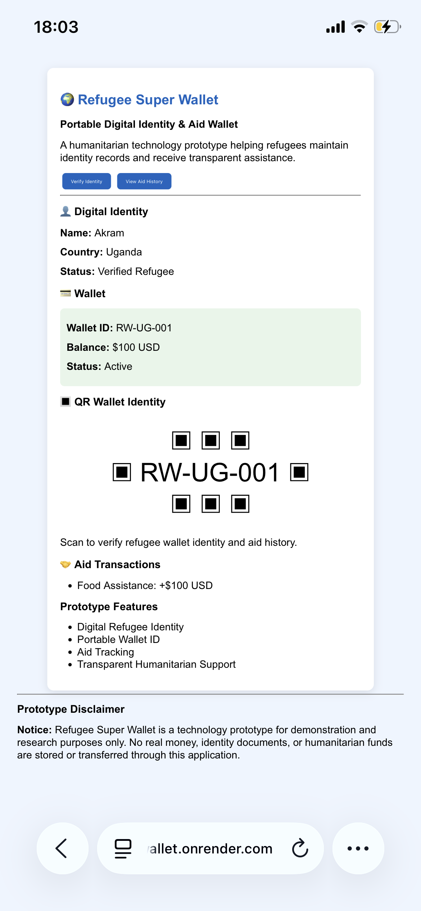

# 🌍 Refugee Super Wallet

## Live Demo

Try the working prototype:

https://refugee-super-wallet.onrender.com

## Screenshot

---

## Overview

Refugee Super Wallet is a digital humanitarian wallet prototype designed to help refugees maintain portable identity records and receive transparent aid support.

The prototype demonstrates how refugees could have:

- Digital identity records
- Portable wallet IDs
- Aid transaction history
- Transparent assistance tracking

## Problem

Many refugees face challenges accessing:

- Identity documentation
- Financial services
- Humanitarian assistance records
- Proof of previous aid received

## Solution

Refugee Super Wallet provides a concept for a secure digital identity and aid management platform.

## Prototype Features

### Digital Identity
Stores refugee profile information.

### Digital Wallet
Creates a wallet linked to a refugee identity.

### Aid Tracking
Records humanitarian assistance transactions.

### QR Identity
Future feature allowing quick wallet verification.

## Technology

Backend:
- Python
- Flask

Architecture:
- Models
- Services
- API Routes

Deployment:
- GitHub
- Render Cloud Hosting

## Current Status

This is a prototype demonstration. No real money, identity documents, or humanitarian funds are stored or transferred.

## Future Development

- Secure authentication
- Organization verification
- QR identity cards
- Mobile application
- Humanitarian partner integrations

## Disclaimer

This is an independent technology prototype created for demonstration and educational purposes.

It is not an official UNHCR service, licensed financial service, or real payment platform.